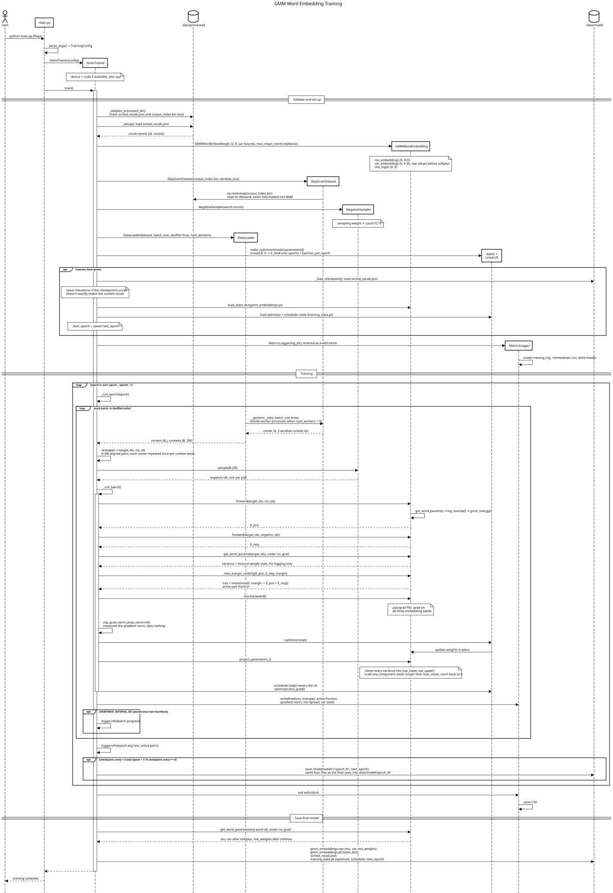

# Training reference

The full command-line reference for both pipeline stages, plus checkpointing/resuming and the per-batch metrics log. For the quickstart version of this (just enough to get a first model trained), see the main [README](../README.md#installation).

## Table of Contents

- [Preprocessing flags](#preprocessing-flags)
- [Training flags](#training-flags)
- [How a training run flows](#how-a-training-run-flows)
- [Checkpointing and resuming](#checkpointing-and-resuming)
- [Metrics log](#metrics-log)

## Preprocessing flags

Run `python src/preprocess.py --help` for this list from the source of truth. `--raw_dir` and `--hf_dataset` are mutually exclusive — pick one corpus source.

| Flag | Default | Meaning |
|---|---|---|
| `--processed_dir` | `data/processed` | Where to write `sorted_vocab.json`/`corpus_index.bin` |
| `--text_key` | `text` | Field/column name containing document text, used for every local format except plain `.txt`, and for Hugging Face datasets |
| `--raw_dir` | `data/raw` | Local file or directory to preprocess: `.txt`, `.jsonl`, `.csv`/`.tsv`, `.parquet`, or `.arrow` (the first four may also be `.gz`/`.bz2`-compressed) |
| `--hf_dataset` | `None` | Hugging Face Hub dataset repo id to download instead of local files, e.g. `wikimedia/wikipedia` |
| `--hf_config` | `None` | Dataset config/subset name required by some Hugging Face datasets, e.g. `20231101.simple` |
| `--hf_split` | `train` | Dataset split to use for a Hugging Face dataset |
| `--stopwords` | `english` | `english` (built-in list), `none`, or a path to a text file with one word per line |

Re-run preprocessing whenever the corpus or `--stopwords` setting changes — the vocabulary (and therefore every word's id) changes with them, so a trained model and the `sorted_vocab.json` it was trained against must come from the same preprocessing run.

## Training flags

Run `python main.py --help` for this list from the source of truth.

| Flag | Default | Meaning |
|---|---|---|
| `--processed_dir` | `data/processed` | Where to read `sorted_vocab.json`/`corpus_index.bin` from |
| `--output_path` | `data/model` | Directory to write the trained model into |
| `--embedding_dim` | `50` | Dimensionality (`D`) of each Gaussian component |
| `--k` | `2` | Number of mixture components (`K`) per word |
| `--window_size` | `5` | Context window size on each side of the center word (counted after stopword removal) |
| `--batch_size` | `256` | Training batch size |
| `--epochs` | `50` | Number of training epochs |
| `--optimizer` | `adam` | `adam` or `adagrad` |
| `--lr` | `0.01` | Initial learning rate |
| `--lr_final` | `1e-5` | Learning rate at the end of training; it decays linearly from `--lr` over the whole run |
| `--margin` | `1.0` | Margin for the max-margin ranking loss |
| `--checkpoint_every` | `0` | Save a snapshot model into `output_path/epoch_<N>/` every N epochs (`0` disables it) |
| `--resume_from` | `None` | Directory of a previous checkpoint to continue training from (see below) |
| `--log_dir` | `logs/` | Where the per-batch training log CSV is written |
| `--num_workers` | `0` | Background processes to prepare batches in parallel. Keep at `0` on a laptop; set above `0` on a GPU machine, sized to the CPUs available, so data loading doesn't leave the GPU idle between batches |
| `--var_lower` | `0.05` | Smallest variance a Gaussian component may have in any dimension; enforced after every optimizer step (see below) |
| `--var_upper` | `5.0` | Largest variance a Gaussian component may have in any dimension |
| `--max_mean_norm` | `8.0` | Largest L2 norm a Gaussian component's mean may have; a longer mean is scaled back to this length without changing its direction |
| `--num_negatives` | `1` | Negative samples per positive pair — **don't change this yet**; multi-negative training isn't implemented (see [Stretch goals](ROADMAP.md#stretch-goals)) |

**Parameter bounds.** Without limits, the max-margin loss can keep shrinking some variances toward zero (making a word's density extremely sharp along a few dimensions) and growing others, and keep lengthening means, without the embedding getting any better. The original paper bounds both for the same reason. After every optimizer step, training clamps every variance into `[--var_lower, --var_upper]` and scales any component mean longer than `--max_mean_norm` back to that length. The bounds apply to each Gaussian component separately, not to a word's whole row. They aren't saved in the checkpoint, so a resumed run uses whatever bounds it's given; changing them on resume is safe, and the next step simply pulls the weights into the new bounds.

This produces `data/model/gmm_embeddings.npz` and `data/model/gmm_embeddings.pt` (plus `training_state.pt`, covered below). See the main README's [How to use the resulting word embedding](../README.md#how-to-use-the-resulting-word-embedding) for what to do with them.

## How a training run flows

This sequence diagram traces one `python main.py` run from start to finish: setup, the optional resume from a checkpoint, the per-batch forward/backward/step loop (including the parameter projection), periodic checkpoints, and the final save.

The diagram is generated from [diagrams/training_sequence.txt](diagrams/training_sequence.txt). To change it, edit that file, paste it into [sequencediagram.org](https://sequencediagram.org), and re-export the SVG over this one.

## Checkpointing and resuming

**`--checkpoint_every N`** saves a full snapshot — `gmm_embeddings.npz`, `gmm_embeddings.pt`, `sorted_vocab.json`, and `training_state.pt` — into `output_path/epoch_<N>/` every `N` epochs, in addition to the final save into `output_path/` once training finishes. `training_state.pt` holds the optimizer's state (e.g. Adam's per-parameter moment estimates) and the learning-rate scheduler's state, not just the model's weights.

**`--resume_from <checkpoint_dir>`** continues training from one of those snapshots instead of starting fresh, restoring the model weights, the optimizer state, and the scheduler state — so training picks back up exactly where it left off, rather than warm-starting from good weights with momentum and the learning-rate decay reset to their initial values. This matters because:
- Reloading only the weights would restart Adam's momentum from zero.
- The `LinearLR` schedule decays over the *whole* run (`total_iters = epochs * batches_per_epoch`, computed from the config); reloading only the weights would restart the learning rate back up at `--lr` instead of continuing the decay toward `--lr_final`.

A resumed run must use the **same `--processed_dir`, `--embedding_dim`, `--k`, and `--epochs`** as the original run:
- `--processed_dir` must match because the checkpoint's vocabulary is checked against the one just built from `--processed_dir`, and training refuses to continue (raising an error rather than proceeding) if they don't match exactly — a mismatched vocab with the same size would otherwise silently assign every embedding row to the wrong word, with no shape error to catch it.
- `--embedding_dim`/`--k` must match because the saved tensor shapes have to line up when the weights are reloaded; a mismatch raises a PyTorch shape error.
- `--epochs` must match the original run's total, since the learning-rate schedule's total step count is recomputed from the config each time rather than saved — changing it part-way through a resumed run shifts the decay schedule away from what the restored scheduler state assumed.

Pointing `--resume_from` at a checkpoint from an already-completed run (where every epoch up to `--epochs` has already run) is harmless: training loop simply has nothing left to do, and re-saves the same final model.

## Metrics log

Every batch, training appends one row to a CSV in `--log_dir` (`training_log_<timestamp>.csv`). Columns:

| Column | Meaning |
|---|---|
| `epoch`, `batch` | 0-based indices of this row's epoch and batch within it |
| `epoch_elapsed_sec`, `batch_elapsed_sec` | Wall-clock time for the epoch so far, and for this batch alone |
| `loss` | This batch's mean max-margin ranking loss |
| `positive_energy`, `negative_energy` | This batch's mean energy for the real `(target, context)` pairs and the sampled negative pairs, respectively — training is pushing the first up and the second down |
| `active_pair_fraction` | The fraction of this batch's pairs where the margin was still violated (`margin − E_pos + E_neg > 0`), i.e. still contributing a nonzero gradient. Starts near `1.0`, drops quickly early in training, then levels off and stays roughly flat, typically somewhere around `0.6` at the default settings. It levels off because some violations can't be fixed: a random negative is sometimes genuinely related to the target word, and some words in the context window are only weakly related to it. A slight rise late in a run isn't a problem as long as `loss` keeps falling. The hinge loss pulls badly violating pairs back toward the margin, so they turn into pairs that still violate it, but only slightly: still counted here, but contributing less loss. Use `loss` as the signal that training is still improving, not this column. If this column collapses toward `0` almost immediately, the model is satisfying the margin too easily to keep learning (margin too small); if it stays near `1.0` the whole run, positives and negatives aren't being separated at all |
| `gradient_norm` | The global L2 norm of the gradient across all of the model's parameters for this batch, measured right after `backward()`. A sudden spike signals the early stages of exploding gradients, since this training loop doesn't clip |
| `mix_weight_spread` | Average, across this batch's target words, of each word's largest mixture-component weight. Close to `1/K` means a word's `K` components are being used about equally; close to `1.0` means one component dominates (e.g. a word that hasn't developed — or doesn't need — multiple senses) |
| `var_min`, `var_max`, `var_mean` | The smallest, largest, and mean variance among this batch's target words' Gaussian components, across every dimension. Useful for checking how many components sit against the `--var_lower`/`--var_upper` bounds; a long-running `var_min` or `var_max` pinned to a bound means the loss wants to push past it |

`active_pair_fraction`, `gradient_norm`, `mix_weight_spread`, and the `var_*` columns are all computed from the batch's **target** words only (not the context words or the sampled negatives) — a deliberate, but arbitrary-among-alternatives, choice; see `GmmTrainer._run_batch` in `src/gmm_training.py` if you want to change what they're computed over.
